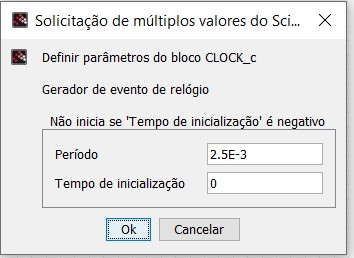
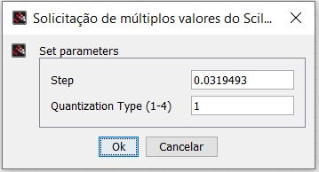
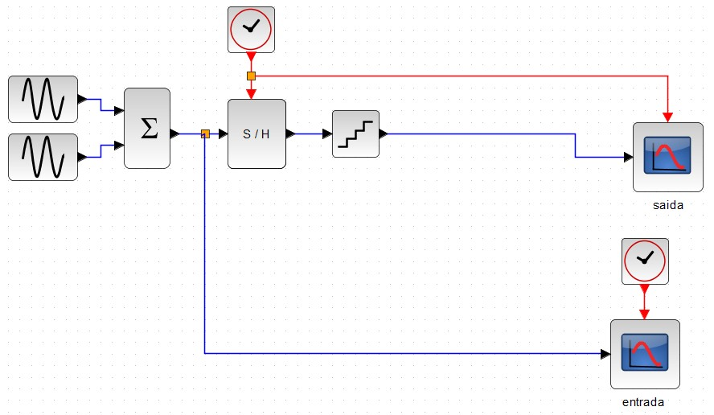

# PBLE04 - CONFIGURABLE MODULATOR DESIGN IN FPGA
# Software Defined Radio (SDR) #

## Etapa 1: 14/09/21 
- Aplicar PCM (8 bits) no sinal modulante m(t) = 3cos(20πt) + 2cos(40πt + π/6) no Scilab. 
##### Raciocionio:
- Amostragem:
Frequência de amostragem escolhida: 20x maior frequência presente em m(t), logo Fs = 20x20 => Fs = 400Hz

$ Ts = \frac{1}{400} $ 

$Ts = 2,5\ ms$ 

- Quantização:
    - Exigido 8 bits
    - Min do Sinal: -3.253637
    - Max do Sinal: 4.925403
    - Range: 8.17904

Cálculo do step para utilizar em bloco QUANT_f:
$ Ts = \frac{8.17904}{2^8} = 0.0319493 $ 

- Codificação:

###### Estado atual Codificação PCM:

## Etapa 2: 28/09/21 
- Gerar o sinal PWM das amostras da etapa 1 por simulação de FPGA e no Scilab.
## Etapa 3: 05/10/21 
- Filtrar o sinal PWM com FPB no Xcos do Scilab. Prazo: 05/10/21

## Etapa 4: 19/10/21 
- Obter o sinal PWM (usar o teorema da amostragem passa-faixa) do sinal BASK (fc = 10 MHz) da representação digital de m(t) por simulação de FPGA e no Scilab. 

## Etapa 5: 26/10/21 
- Filtrar o sinal da etapa 4 para obter o sinal BASK no Xcos do Scilab.

## Etapa 6: 09/11/21 
- Obter o sinal PWM (usar o teorema da amostragem passa-faixa) do sinal BPSK (fc = 10 MHz) da representação digital de m(t) por simulação de FPGA e no Scilab. 

## Etapa 7: 23/11/21 
- Filtrar o sinal da etapa 6 para obter o sinal BPSK no Xcos do Scilab. 

## Etapa 8: 07/12/21 
- Obter o sinal PWM (usar o teorema da amostragem e fs = N * MMC(fc1, fc2), N inteiro) do sinal BFSK (com  8,5 MHz < fc1 < 9,5 MHz e fc2 = 10,5 MHz < fc2 < 11,5 MHz e tal que não ocorra descontinuidades na transição de bit) da representação digital de m(t) por simulação de FPGA e no Scilab. 

## Etapa 9: 14/12/21 
- Filtrar o sinal da etapa 8 para obter o sinal BFSK no Xcos do Scilab. 
